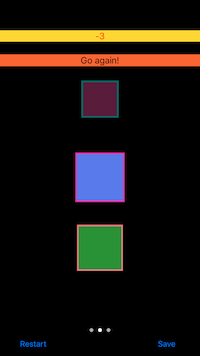

# Game: Pick The Largest Shape For Fun

Early work in progress. This is my attempt to work thru learning Swift, Xcode, and iOS by building a game. 

The eventual goal is to have a well architected solution using value types, design patterns, and protocols. Right now the solution is pretty ugly but primarily focused on getting certain features to work and will refactor as I get comfortable with how best to do things.

I wanted to have different game types, circles/squares/mixed/etc, playable by simply allowing user to scroll thru each type and just start playing by click a shape. After spending some time learning scroll views I found that page views handle this without me having to recreate the functionality to handle centering and knowing which page/game users are on.

The main challenge I had with the page views, from following tutorial outlined below, was to not have pages reload automatically when revisited, scrolled to, but instead show the game as the user left it and when clicking Restart button to effect only the currently loaded game.

Right now the code and organization are a mess but that will be next and then I will add saving state, user accounts, and getting layout to work for most/all devices and orientations. Will also look at adding more shapes like triangles.

Currently I have an issue with rotating squares getting chopped when the corners are too wide for the view they are living in.

##Tested On:
Tested with Xcode 7.2.1, iOS 9.2, and running on iPhone 6s, portrait

##Inspiration borrowed from tutorials at:

###Ray Wenderlich's site: Intermediate Design Patterns In Swift
http://www.raywenderlich.com/86053/intermediate-design-patterns-in-swift

###Vea Software at YouTube: UIPageViewController in Swift - Xcode 6.2 iOS 8.2 Tutorial 
https://www.youtube.com/watch?v=8bltsDG2ENQ

##Screenshots:

Circles Game: 

Squares Game: 

Circles And Squares Game: 

Messages For Streaks: 

