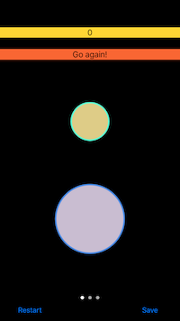
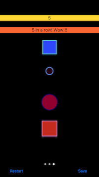

# Game: Pick The Largest Shape For Fun

Early work in progress. This is my attempt to work thru learning Swift, Xcode, and iOS by building a game. 

The eventual goal is to have a well architected solution using value types, design patterns, and protocols. Right now the solution is pretty ugly but primarily focused on getting certain features to work and will refactor as I get comfortable with how best to do things.

I wanted to have different game types, circles/squares/mixed/etc, playable by simply allowing user to scroll/page thru each type and just start playing by tapping a shape. After spending some time learning scroll views I found that page views handle this without me having to recreate the functionality to handle centering and knowing which page/game the user is on.

The main challenge I had with the page views, from following tutorial outlined below, was to not have pages reload automatically when revisited, scrolled to, but instead show the game as the user left it and when clicking Restart button to effect only the currently loaded game.

Went down the road of using Firebase to handle data but backed it all out and back to Core Data for now. I don’t currently know a good way to have game downloadable and work when hiding Firebase details from the general public.

Reworked the rendering of shapes to handle landscape and proportion spacing better in general. This was made complicated by having shapes that could generate in portrait that when orientation moved to landscape they would be clipped for not fitting. So I worked out scaling shapes down and back up again when orientation changes as needed. This should set the stage for getting things to work, look right, on multiple platforms instead of just iPhone 6s. Currently works on 4s in landscape but not portrait, haven’t tested others as yet.

##Tested On:
Tested with Xcode 7.2.1, iOS 9.2, and running on iPhone 6s, portrait

##Inspiration borrowed from tutorials at:

###Ray Wenderlich's site: Intermediate Design Patterns In Swift
https://www.raywenderlich.com/86053/intermediate-design-patterns-in-swift

###Vea Software at YouTube: UIPageViewController in Swift - Xcode 6.2 iOS 8.2 Tutorial 
https://www.youtube.com/watch?v=8bltsDG2ENQ

##Screenshots:

Instructions Screen: 

Circles Game: 

Circles Game Landscape: 

Squares Game: 

Circles And Squares Game With 5 In A Row Streak: 

